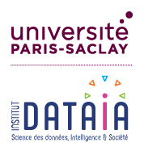

# X-Datascience Datacamp

*Datacamp class for master student - 5 days*

The aim of this course is to learn data science by doing. All aspects of completing a data science pipeline will be covered, from exploratory data analysis (EDA), feature engineering, parameter optimization to advanced learning algorithms. You will also need to setup your own challenge!

Grade is a mix of your performance on the data challenge offered to the class as well as the challenge you will setup.

Each day you will have 50% of lectures and 50% of work on the competitive challenge using the [RAMP](https://ramp.studio/) website.

The slides used in some of the lectures are available [here](https://drive.google.com/drive/folders/1JvosHOvskofoBgf3CKLaQ72F_UET9aVX?usp=sharing).

### Instructors:

- [Thomas Moreau](https://tommoral.github.io/about.html) (thomas.moreau@inria.fr)
- [Pedro L. C. Rodrigues](https://plcrodrigues.github.io/) (pedro.rodrigues@inria.fr)

### Location

The course will be during the week from Dec 16 to Dec 20 2025 in person.

To join the discord channel use this [URL](TODO).

On GitHub you have some of the teaching materials at: https://github.com/x-datascience-datacamp

You **must** have a GitHub account to complete the course.

### Setup:

We will be using many Python packages in this course such as `pandas`, 
`sklearn`, and `matplotlib`, and they can all be downloaded and installed using
a package-management system. We recommend you to use [`mamba`](https://mamba.readthedocs.io/)
but you will be fine if you already have [`conda`](https://docs.conda.io/en/latest/) 
installed in your computer.

**NB**: Windows users should be sure to closely follow the instructions for 
installing `mamba` and `conda`, since many common problems come from not having 
properly setup the `PATH` variable for the system.

## Day 1: Data wrangling

- Introduction to the workflow (VSCode, python distribution, git, github, tests, ...)
- Advanced course on Pandas
- Github **assignments**: [numpy](https://github.com/x-datascience-datacamp/datacamp-assignment-numpy) and [pandas](https://github.com/x-datascience-datacamp/datacamp-assignment-pandas)

## Day 2: ML Pipelines and model evaluation

- Advanced scikit-learn: Column transformer and pipelines
- Parallel processing with joblib
- Generalization and Cross Validation
- **Assignment** [sklearn](https://github.com/x-datascience-datacamp/datacamp-assignment-sklearn)
- Getting started on RAMP & Introduction to the challenges.

## Day 3: Metrics and dealing with unbalanced data

- Presentation of the different ML metrics
- Problem of the metric with imbalanced data
- ML approaches to deal with imbalanced data
- **Working on data challenges**

## Day 4: Working with complex data

- Feature engineering and advanced encoding of categorical features
- Working with signals and time series
- Model inspection: Partial dependence plots, Feature importance
- **Working on data challenges**

## Day 5: Ensemble methods and hyperparameter optimization

- From trees to gradient boosting
- Profiling with snakeviz
- Hyperparameter optimization
- **Working on data challenges**

## Institutional information

This class is teached in the context of the [Master Data Science](https://www.ip-paris.fr/en/education/masters/applied-mathematics-and-statistics-program/master-year-2-data-science) at [Institut Polytechnique de Paris](https://www.ip-paris.fr/).  
It receives support from [Hi!Paris](https://www.hi-paris.fr/) and [DataIA](https://www.dataia.eu/).

</img>
</img>

